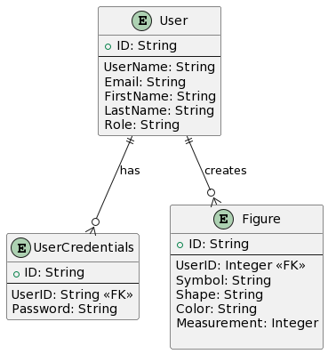

# figure-api

## Description

This is a simple API for a figure database. It is built with LoopBack 4, MongoDB and TypeScript.

## Build and run the application

### Install dependencies

By default, dependencies were installed when this application was generated.
Whenever dependencies in `package.json` are changed, run the following command:

```sh
yarn install
```

### Set up MongoDB

You need to have a running MongoDB instance. You can use a local instance or a remote one. The connection string is defined in `src/datasources/mongodb.datasource.ts`.
For a local instance, you can run a MongoDB instance in a Docker container:

```sh
docker run -d -p 27017:27017 --name figure-db mongo
```

I have already written docker-compose file for this. You can run the following command to start the MongoDB instance:

```sh
docker-compose up -d figure-db
```

### Run the application

```sh
yarn start
```

You can also run `node .` to skip the build step.

Open http://127.0.0.1:3000 in your browser.

### Rebuild the project

To incrementally build the project:

```sh
yarn run build
```

To force a full build by cleaning up cached artifacts:

```sh
yarn run rebuild
```

### Fix code style and formatting issues

```sh
yarn run lint
```

To automatically fix such issues:

```sh
yarn run lint:fix
```

### Other useful commands

- `yarn run migrate`: Migrate database schemas for models
- `yarn run openapi-spec`: Generate OpenAPI spec into a file
- `yarn run docker:build`: Build a Docker image for this application
- `yarn run docker:run`: Run this application inside a Docker container

## Tests

```sh
yarn test
```

## API documentation

The API documentation is available at http://localhost:3000/explorer, inspired by the OpenAPI spec.

## ERD



Image gererated by [plantuml](https://plantuml.com/)


This is the ERD for the figure database:
- It contains three models: `Figure` and `User` and `UserCredentials`.
- A `Figure` belongs to a `User`
- A `User` has many `Figure`s.
- A `User` has one `UserCredentials`.

## Infrastructure

Todo: Add terraform files to create the infrastructure in AWS.

## License

MIT